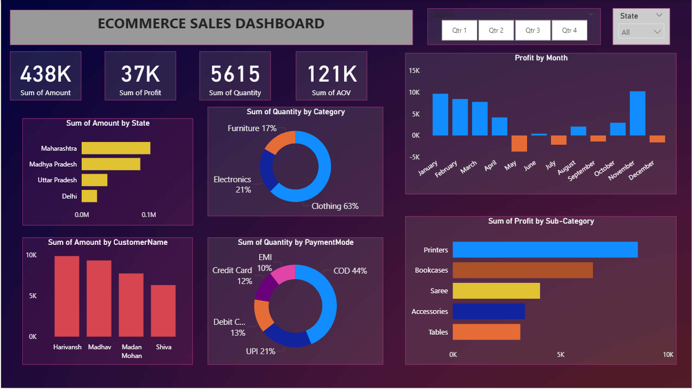

# Ecommerce Sales Dashboard - Power BI

## 📌 Project Overview
This project is an *Ecommerce Sales Dashboard* created using *Power BI* to analyze sales, profit, quantity, customer behavior, and payment trends.

The dashboard helps in understanding business performance and identifying important insights for decision-making.

---

## 📊 Dashboard Metrics
- *Total Sales Amount:* 438K
- *Total Profit:* 37K
- *Total Quantity Sold:* 5615
- *Average Order Value (AOV):* 121K

---

## 🔍 Key Insights
- *Maharashtra* generated the highest sales amount.
- *Clothing* was the top category with *63%* of total quantity sold.
- *COD* was the most preferred payment mode with *44%* share.
- *Printers* gave the highest profit among sub-categories.
- Monthly profit showed both positive and negative trends.

---

## 📈 Dashboard Features
- KPI Cards for Sales, Profit, Quantity, and AOV
- State-wise Sales Analysis
- Category-wise Quantity Distribution
- Monthly Profit Trend
- Customer-wise Sales Contribution
- Payment Mode Analysis
- Sub-category Profit Analysis
- Quarter and State Filters

---

## 🛠 Tools Used
- *Power BI*
- *Data Cleaning*
- *Data Visualization*

---

## 📷 Dashboard Preview

---

## 📂 Files in this Project
- powerbiEcommercesalesdashboard.pbix
- PowerBIDetails.csv
- PowerBIOrders (1).csv
- Screenshot 2026-04-02 213105.png

---

## 📚 Learning Outcomes
Through this project, I learned:
- How to create interactive dashboards in Power BI
- How to use filters and slicers effectively
- How to derive business insights from sales data
- How to present data visually for decision-making
